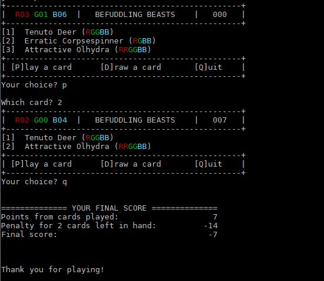

# Assignment 02

## Challenge: Befuddling Beasts Game

### Preamble

So when I was coding up the MtG: Arena drill, I was thinking "Hey - this could actually become an assignment!".

So I started to do that, and one thing led to another, and we wound up here. Life's so weird.

If you haven't done the **WEEK-03: MtG card** drill, I'd suggest doing it before continuing. Also, having any of the **WEEK-06: input validation** drills would be useful as well. Oh, and **WEEK-04: rewarder**. But not the hex grid drill - that'd be a jerk move.

**The Game Of Befuddling Beasts**

In Befuddling Beasts (just a name I made up), you have a hand of beast cards that cost a certain combination of colors (Red, Green, and Blue) to play. You also have a "pool" of colors (red, green, and blue) that you use to pay for these beasts.

On your turn, you have 3 options:

- play a beast
- draw a beast **and** a color
- quit the game

Every time you play a creature, your score goes up on a sliding scale:

- beast with cost of 1: 0 points
- beast with cost of 2 or 3: 2 points
- beast with cost of 4 or 5: 7 points
- beast with cost of 6: 10 points

The game is over when you reach 30 points (or you want to quit).

After the game is over, you will be assigned a penalty according to how many cards you have left in your hand:

- 0 cards: no penalty
- 1 card: -5 points
- 2 cards: -14 points
- 3+ cards: -10 points PER CARD

So to get a good score, you have to play beast cards...but you want to try to end the game with as few cards as possible.

---

### What you're going to build

You're going to be making an application that allows a user to play a game of Befuddling Beasts.

Each turn, the user will be shown a display that shows the player what colors they have in their pool, how many points they have, a list of the beasts they have available, and a selection of options.

They will then choose whether they want to play a beast, draw a beast & color, or quit. (There will be some validation going on here. It involves loops. It isn't fun - validation isn't really fun.)

Let's watch a couple of runs so you can get a feel for all this.

**Example Run 1**

> Commentary on Run 1
>
> - The application starts up and shows the `PlayAreaView`, which consists of the current colors available (3 red, 4 green, and 3 blue here), the current score (000), a list of beast cards in the player's hand, and some menu options.
> - Although things are all colored nicely, you only need to do that for an A+ level. Maybe you want to wait to do that until later?

**Example Run 2**

> Commentary on Run 2
>
> - Here we see what happens when a user tries to enter an invalid menu option: a semi-helpful error message is displayed and then the user is re-prompted.

**Example Run 3**

> Commentary on Run 3
>
> - This is a bit longer...let's walk through this.
> - 

**Example Run 4**

> Commentary on Run 4
>
> - TBA
